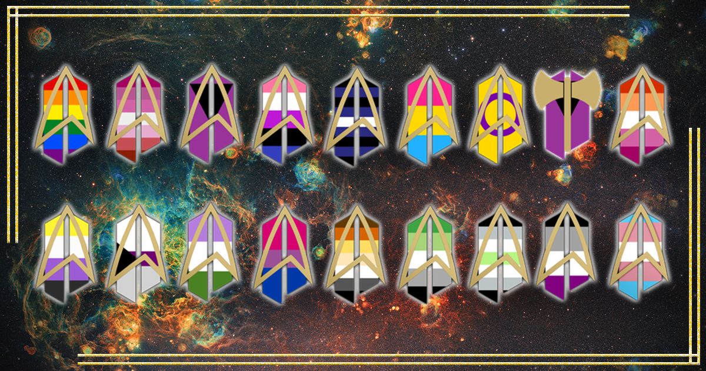

# star-trek-lgbtq-emoji
Star Trek-themed LGBTQ emoji for use on Discord and other communication tools. 

How to add custom emojis to... 
* Discord: https://support.discord.com/hc/en-us/articles/360036479811-Custom-Emojis
* Slack: https://slack.com/help/articles/206870177-Add-custom-emoji
* Invision forums: https://invisioncommunity.com/4guides/themes-and-customizations/editor-and-emoticons_327/managing-emoticons-r136/

## Sourcing
* Emoji were designed by: Cait Cayne for [UFOP: StarBase 118 Star Trek PBEM RPG](https://www.starbase118.net)
* Flag backgrounds were sourced from Wikipedia: https://en.wikipedia.org/wiki/LGBT_symbols

## Licensing
 This work is licensed under a <a rel="license" href="http://creativecommons.org/licenses/by-sa/3.0/">Creative Commons Attribution-ShareAlike 3.0 Unported License</a>.
